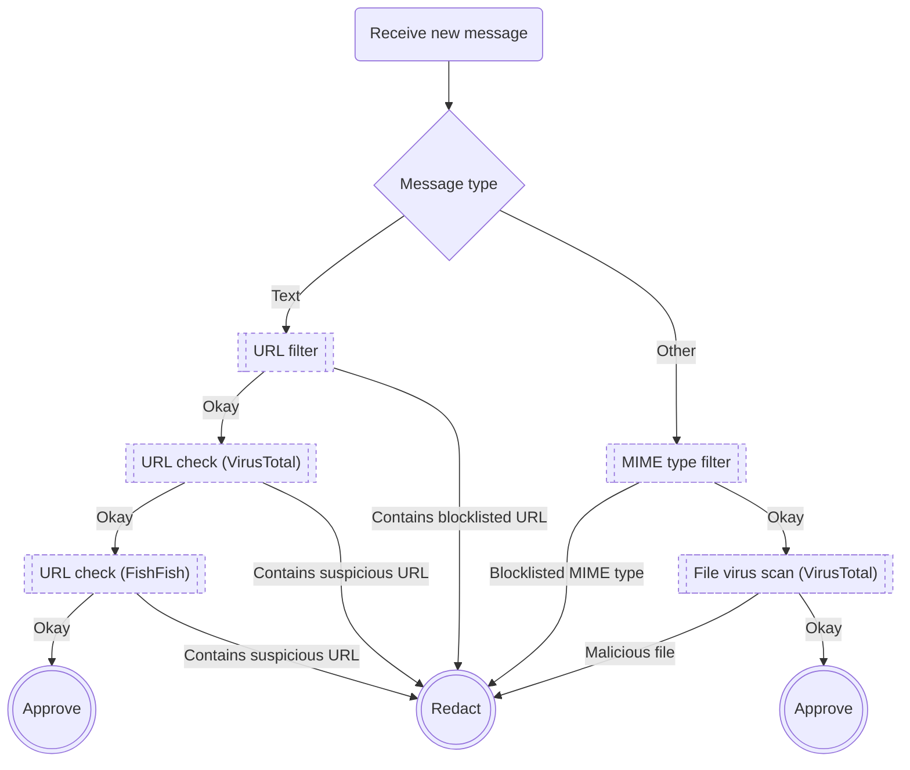

### ⚠️ Experimental; do not use in production yet

# 🛡️ Matrix Guardian 🛡️

- [Disclaimer](#disclaimer)
- [Features](#features)
  - [URL Filter 🌐](#url-filter-)
  - [URL Phishing Check 🗡️](#url-phishing-check-)
    - [VirusTotal](#virustotal)
    - [FishFish](#fishfish)
  - [File MIME Type Filter 📎](#file-mime-type-filter-)
  - [File Virus Scan 🦠](#file-virus-scan-)
    - [VirusTotal](#virustotal-1)
  - [planned] *Keyword Filter* 📄
- [Flowchart](#flowchart)
- [Protected Public Rooms (Mentions)](#protected-public-rooms-mentions)
- [License](#license)

---

## Disclaimer

Guardian is not a user moderation bot and only analyzes messages themselves.  
If you are looking for user moderation, check out [the-draupnir-project/Draupnir](https://github.com/the-draupnir-project/Draupnir) or [matrix-org/mjolnir](https://github.com/matrix-org/mjolnir).

---

## Features

### URL Filter 🌐

**Activation (default: true)**: `GUARDIAN_URL_FILTER: true|false`  
**Help Command**: `!gd url`

Guardian supports URL filtering based on a customizable domain list.

**Examples**:
- `!gd url block t.me`
- `!gd url unblock t.me`
- `!gd url list`

### URL Phishing Check 🗡

Guardian supports checking URLs in messages for suspicious content.  
The analysis can be powered by the following providers:

#### VirusTotal

**Reference**: https://docs.virustotal.com/reference/url-info  
**API-Key (required)**: `GUARDIAN_VIRUS_TOTAL_KEY: <key>`  
**Activation (default: false)**: `GUARDIAN_URL_CHECK_VIRUS_TOTAL: true|false`

VirusTotal allows scanning a full URL and returning a very comprehensive scan report.  
Guardian rates a URL "suspicious" if the statistics `malicious` and `suspicious` have a combined score of 3 or more.

#### FishFish

**Reference**: https://fishfish.gg  
**Activation (default: false)**: `GUARDIAN_URL_CHECK_FISHFISH: true|false`

FishFish allows scanning a domain and returning a rating, if found in their reports.  
Guardian rates a URL "suspicious" if the FishFish rating is `malware` or `phishing` rather than `safe`.

### File MIME Type Filter 📎

**Activation (default: true)**: `GUARDIAN_MIME_FILTER: true|false`  
**Help Command**: `!gd mime`

Guardian supports file MIME type filtering based on a customizable MIME type list.

**Examples**:
- `!gd mime block application/zip`
- `!gd mime unblock application/zip`
- `!gd mime list`

### File Virus Scan 🦠

Guardian supports checking message attachments for malware.  
(Currently this is limited to hash-based lookup, the long delay of live scans is a problem).  
The analysis can be powered by the following providers:

#### VirusTotal

**Reference**: https://docs.virustotal.com/reference/file-info   
**API-Key (required)**: `GUARDIAN_VIRUS_TOTAL_KEY: <key>`  
**Activation (default: false)**: `GUARDIAN_VIRUS_CHECK_VIRUS_TOTAL: true|false`

VirusTotal allows passing a hash (Guardian uses sha256) and returning a related report if one exists.  
Guardian rates a URL "suspicious" if the statistic `malicious` is >1 or `suspicious` is >3.

## Flowchart

The following chart explains how the Guardian handles messages and checks them step by step.

## Protected Public Rooms (Mentions)

This list showcases some of the rooms who use the Matrix Guardian 🛡️:  
*If you would like to add a room, please open an [issue](https://github.com/cyb3rko/matrix-guardian/issues)*

- [CachyOS Community (tchncs.de)](https://matrix.to/#/#cachyos:tchncs.de)

## License

    This Source Code Form is subject to the terms of the Mozilla Public
    License, v. 2.0. If a copy of the MPL was not distributed with this
    file, You can obtain one at https://mozilla.org/MPL/2.0/.
